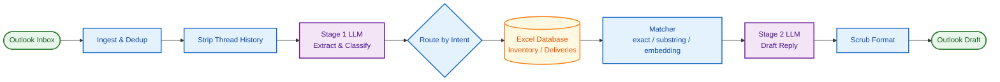

<p align="center">
  
  
  
  
  
</p>

<h1 align="center">InBoxD</h1>

<p align="center">
  <strong>AI-Powered Email Classification and Auto-Reply Drafting System</strong>
</p>

<p align="center">
  <em>An enterprise-grade n8n automation that monitors an Outlook inbox, classifies vendor and customer inquiries using a two-stage LLM pipeline, queries an Excel database, and drafts professional replies without sending them.</em>
</p>

<p align="center">
  <a href="docs/cloud_setup.md">Cloud Setup</a> |
  <a href="docs/local_setup.md">Local Setup</a> |
  <a href="docs/architecture.md">Architecture</a> |
  <a href="docs/comparison_cloud_vs_local.md">Cloud vs Local</a>
</p>

---

## Pipeline Overview



---

## Key Features

<table>
<tr>
<td width="50%" valign="top">

### Zero-Hallucination Architecture
Three-layer defense: Prompt Constraints + Data Packet Firewall + Post-LLM Scrubbing. The drafting model never sees raw database fields it should not cite.

### Two Deployment Modes
**Cloud**: OpenAI (gpt-4o-mini) + OneDrive Excel via Microsoft Graph.
**Local**: Ollama (qwen2.5:7b-instruct) + local Excel + Qdrant vector search. All data stays on-premises.

</td>
<td width="50%" valign="top">

### 5 Intent Categories
`Availability_Status` | `Quantity_Inquiry` | `Incoming_Stock` | `Pricing_Request` | `Delivery_Tracking`

### Multilingual Support
English, Italian, German, French, Spanish, Portuguese, and Dutch. Language auto-detected from email body with heuristic override safeguards.

</td>
</tr>
</table>

---

## How It Works

```
Email Arrives
    |
    v
[1] INGEST & DEDUP ---- Triple-layer idempotency (isRead flag + rolling window + message ID)
    |
    v
[2] CLASSIFY ---------- Stage 1 LLM extracts product, intent, language, confidence
    |
    v
[3] ROUTE & RETRIEVE --- Switch by intent -> Load Excel -> Tiered matcher (exact/substring/vector)
    |
    v
[4] DRAFT ------------- Stage 2 LLM generates reply using ONLY matched data values
    |
    v
[5] SCRUB & OUTPUT ---- Strip markdown, placeholders, emoji -> Save as Outlook Draft
```

---

## Design Decisions

| Decision | Rationale |
| :--- | :--- |
| **Excel over SQL** | Realistic proxy for SMB supply chains where Excel is the source of truth |
| **temperature=0** | Classification and entity extraction must be deterministic |
| **mark-as-read idempotency** | In-memory caching fails on container restarts; Outlook `isRead` flag is durable |
| **3-layer anti-hallucination** | Prompt rules + Data Packet Firewall + JS regex scrubbing |
| **Draft-only output** | Human-in-the-loop compliance; no auto-sending |

---

## Compliance

| Control | Implementation |
| :--- | :--- |
| **Zero Auto-Transmission** | Drafts saved to Outlook; human review required before sending |
| **Data Residency** | Local variant (Ollama + Qdrant) keeps all data on-premises |
| **Audit Trails** | Structured logging on every run, aligned with EU AI Act Article 12 |

---

## Repository Structure

```
InBoxD/
  workflows/          n8n workflow JSONs (Cloud and Local variants)
    cloud/            Cloud variant with screenshots
    local/            Local variant with Qdrant integration
  docs/               Architecture, setup guides, and decision records
    diagrams/         Mermaid diagram source files (.mmd)
  docker/             Docker Compose stacks for both variants
  scripts/            Validation, seeding, and security scanning
  prompts/            Canonical LLM prompt templates
  fixtures/           Test email fixtures and expected outputs
  data/               Excel data files (not tracked, populate locally)
```

---

## Quick Start

### Cloud Variant

```bash
# 1. Clone and configure
git clone https://github.com/mlvpatel/InBoxD.git
cd InBoxD
cp .env.example .env   # Fill in your API keys

# 2. Start n8n
docker compose -f docker/docker-compose.cloud.yml up -d

# 3. Import workflow
# Open http://localhost:5678 and import workflows/cloud/workflow.json
```

### Local Variant

```bash
# 1. Start all services
docker compose -f docker/docker-compose.local.yml up -d

# 2. Pull the model
docker exec inboxd-ollama ollama pull qwen2.5:7b-instruct

# 3. Seed vector database
pip install -r scripts/requirements.txt
python scripts/seed_qdrant.py

# 4. Import workflow
# Open http://localhost:5678 and import workflows/local/workflow.json
```

---

## Documentation

| Document | Description |
| :--- | :--- |
| [Cloud Setup](docs/cloud_setup.md) | Step-by-step cloud variant deployment |
| [Local Setup](docs/local_setup.md) | Step-by-step local variant deployment |
| [Architecture](docs/architecture.md) | System architecture with C4 and sequence diagrams |
| [RAG Design](docs/rag_design.md) | Retrieval design and matching ladder methodology |
| [Cloud vs Local](docs/comparison_cloud_vs_local.md) | Decision matrix comparing both variants |
| [Implementation Plan](docs/implementation_plan.md) | Agentic RAG and fine-tuning roadmap |
| [Cloud Workflow](workflows/cloud/README.md) | Cloud workflow node-by-node breakdown |
| [Local Workflow](workflows/local/README.md) | Local workflow node-by-node breakdown |

---

## Roadmap

The current architecture is deliberately bounded. The roadmap charts the evolution into a fully **Agentic RAG** model, warranted when:

1. Catalog scales past 10,000 SKUs
2. Abstract inquiries enter scope (e.g., "What is your return policy?")
3. Read/write transaction capabilities are required

| Component | Purpose |
| :--- | :--- |
| Reasoning Agent | Dynamically selects between SQL, semantic retrieval, or API tool use |
| Knowledge Graph | Handles policy documents, compatibility graphs, and ticket history |
| Dynamic Tool Use | Real-time inventory and shipment tracking APIs |
| Self-Evaluation | Validates the draft answers the question before saving |

See [Implementation Plan](docs/implementation_plan.md) for the full technical specification.

---

<p align="center">
  <sub>Licensed under the <a href="LICENSE">MIT License</a></sub>
</p>
